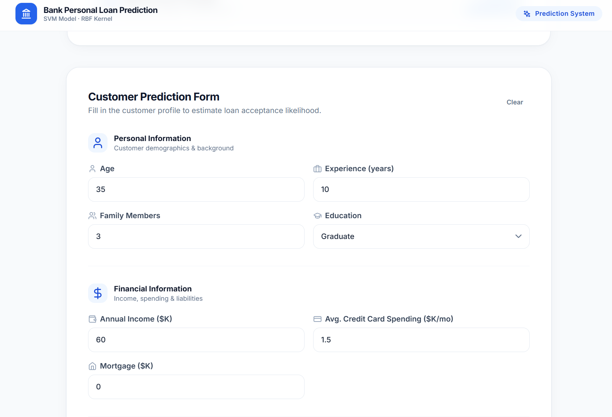
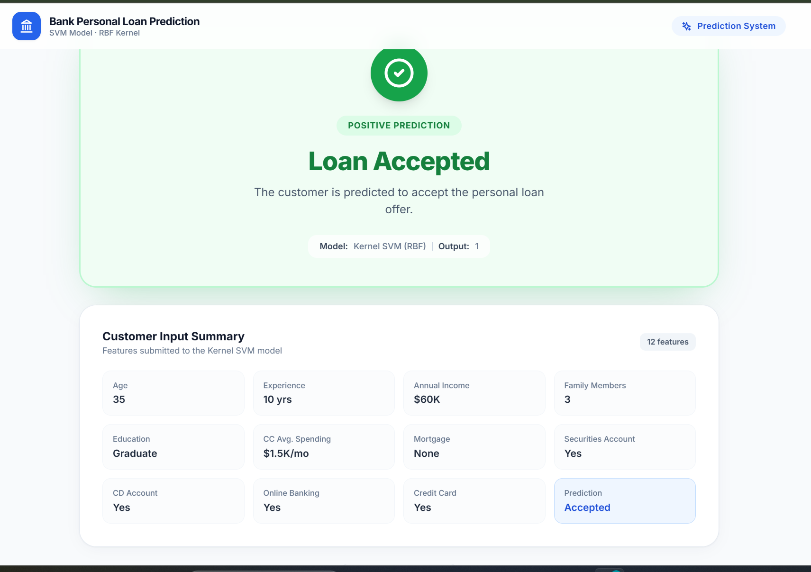
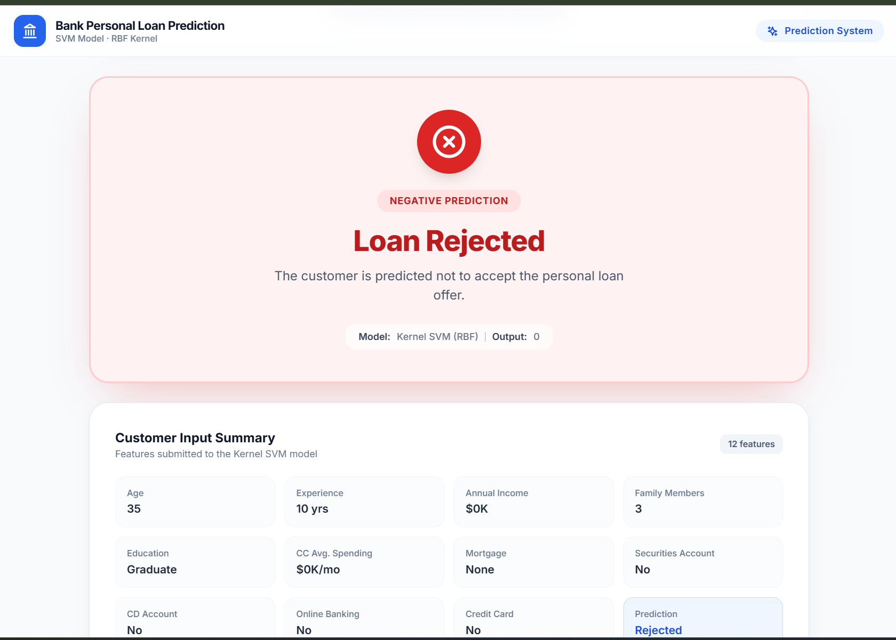
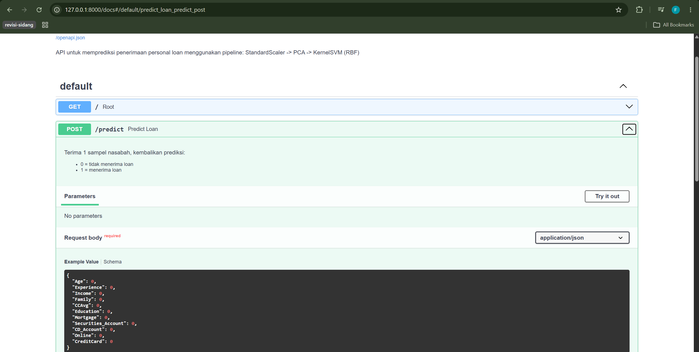
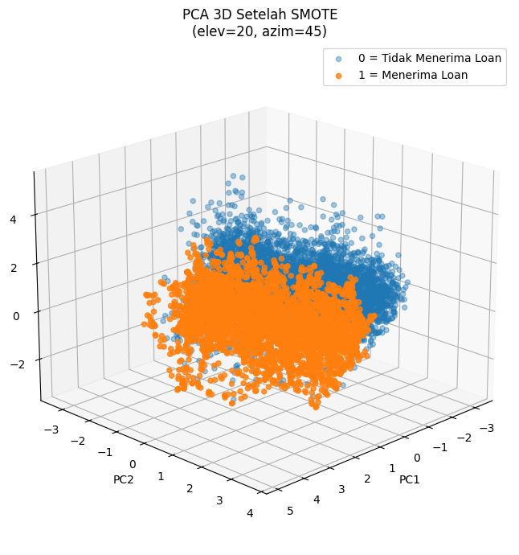
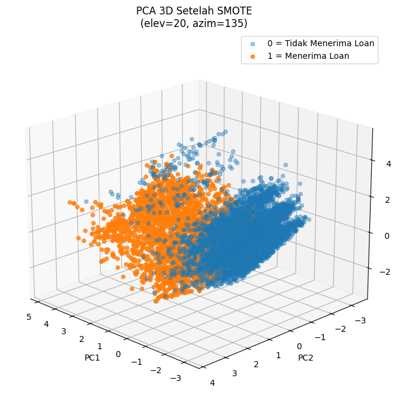
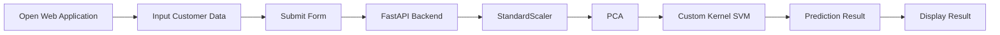

<div align="center">

# 🏦 Bank Personal Loan Acceptance Prediction

### End-to-End Machine Learning Application using Custom Kernel Support Vector Machine (RBF), FastAPI, and React

<p align="center">


</p>

An end-to-end Machine Learning application for predicting whether a customer will accept a personal loan offer using a **custom implementation of Kernel Support Vector Machine (RBF)**, deployed with **FastAPI** and integrated into a modern **React** web application.

</div>

---

# 📸 Proof of Concept

This section demonstrates the complete workflow of the Personal Loan Prediction application, from user interaction to prediction results.

## 1. Landing Page

The application starts with a responsive landing page that introduces the Personal Loan Prediction system and provides access to the prediction feature.

> 📷 **Insert Screenshot**
>


---

## 2. Customer Information Form

Users provide customer information through an intuitive input form.

The required features include:

- Age
- Experience
- Income
- Family
- Credit Card Average Spending (CCAvg)
- Education
- Mortgage
- Securities Account
- CD Account
- Online Banking
- Credit Card

> 📷 **Insert Screenshot**
>


---

## 3. Prediction Result

After submitting the form, the application sends the data to the FastAPI backend.

The backend executes the complete inference pipeline:

```text
Input Features
        │
        ▼
StandardScaler
        │
        ▼
PCA
        │
        ▼
Kernel SVM (RBF)
        │
        ▼
Prediction Result
```

The predicted class and decision score are then returned to the frontend and displayed to the user.

> 📷 **Insert Screenshot**
>



---

## 4. REST API Testing

The prediction service is exposed through a FastAPI REST API.

Interactive API documentation is automatically generated using Swagger UI, allowing developers to test endpoints directly from the browser.

Endpoint:

```http
POST /predict
```

> 📷 **Insert Screenshot**
>


---

## 5. PCA Visualization

Principal Component Analysis (PCA) is applied to transform standardized features into a lower-dimensional representation for model training and visualization.

The figure below illustrates the projected data distribution after preprocessing.

> 📷 **Insert Screenshot**
>



---

## 6. Decision Boundary

The following visualization illustrates the decision boundary learned by the custom Kernel Support Vector Machine using the first two principal components.

It demonstrates how the model separates customers who are likely to accept a personal loan from those who are not.

> 📷 **Insert Screenshot**
>


---

# 🎬 Application Workflow



---

## ✨ End-to-End Workflow Summary

| Step | Description |
|------|-------------|
| 1 | User opens the web application |
| 2 | User fills in customer information |
| 3 | React sends a prediction request to FastAPI |
| 4 | FastAPI preprocesses the data using StandardScaler |
| 5 | PCA transforms the standardized features |
| 6 | The transformed features are classified using the Custom Kernel SVM (RBF) |
| 7 | The prediction result is returned to the frontend and displayed to the user |

---

---

# 📖 Table of Contents

- Project Overview
- Why This Project?
- Business Problem
- Objectives
- Key Features
- Technology Stack
- System Architecture
- Dataset
- Exploratory Data Analysis
- Data Preprocessing
- Manual SMOTE
- StandardScaler
- Principal Component Analysis
- Custom Kernel SVM
- Model Evaluation
- Deployment
- REST API
- Proof of Concept
- Installation
- Project Structure
- Future Improvements
- Author

---

# 📖 Project Overview

Financial institutions continuously market personal loan products to existing customers.

However, offering loans to every customer is expensive and inefficient because only a small proportion of customers are actually interested in accepting the offer.

This project develops an end-to-end Machine Learning application capable of predicting whether a customer is likely to accept a personal loan offer based on demographic, financial, and banking-related information.

Unlike many similar projects that directly rely on Scikit-Learn's `SVC`, this project implements the **Kernel Support Vector Machine algorithm manually**, including kernel computation, optimization, prediction, and deployment.

The trained model is serialized into a Pickle artifact and served through a FastAPI REST API, while the frontend is implemented using React to provide an interactive prediction interface.

---

# ⭐ Why This Project?

Most Machine Learning portfolio projects stop after model training.

This project goes beyond that by implementing a complete machine learning workflow, including:

- Custom implementation of Kernel Support Vector Machine
- Manual implementation of SMOTE for handling imbalanced data
- Data preprocessing using StandardScaler
- Feature transformation using PCA
- Model serialization using Pickle
- Custom Unpickler for loading trained models
- REST API deployment using FastAPI
- Interactive frontend using React
- End-to-end prediction pipeline

This repository demonstrates both **Machine Learning Engineering** and **Backend Development** skills.

---

# 💼 Business Problem

The original dataset contains **5,000 bank customers**, but only **480 customers (9.6%)** accepted the personal loan offer.

This creates a highly imbalanced classification problem where a conventional classifier tends to favor the majority class.

For financial institutions, failing to identify potential customers means:

- Higher marketing costs
- Lower campaign effectiveness
- Lost business opportunities
- Reduced conversion rates

Therefore, an accurate classification model is required to identify customers with a high probability of accepting a personal loan.

---

# 🎯 Project Objectives

The primary objectives of this project are:

- Analyze customer financial data.
- Explore customer characteristics through statistical analysis.
- Handle class imbalance using a manually implemented SMOTE algorithm.
- Reduce feature scale differences using StandardScaler.
- Transform high-dimensional data using PCA.
- Develop a custom Kernel Support Vector Machine classifier.
- Evaluate model performance using multiple classification metrics.
- Deploy the trained model using FastAPI.
- Build an interactive web application using React.

---

# ✨ Key Features

- 📊 Exploratory Data Analysis (EDA)
- 📈 Statistical Data Analysis
- ⚖️ Manual SMOTE Implementation
- 📏 StandardScaler
- 📉 Principal Component Analysis (PCA)
- 🧠 Custom Kernel Support Vector Machine (RBF)
- 📦 Pickle Model Serialization
- 🔄 Custom Pickle Loader (KernelSVMUnpickler)
- 🚀 FastAPI Deployment
- 💻 React Frontend
- 📚 Interactive Swagger Documentation
- ⚡ Real-Time Loan Prediction

---

# 🛠 Technology Stack

| Category | Technology |
|----------|------------|
| Programming Language | Python |
| Machine Learning | Custom Kernel SVM |
| Data Processing | Pandas |
| Numerical Computing | NumPy |
| Data Preprocessing | StandardScaler |
| Dimensionality Reduction | PCA |
| Imbalanced Learning | Manual SMOTE |
| API Framework | FastAPI |
| Frontend | React + Vite |
| Styling | Tailwind CSS |
| Model Serialization | Pickle |
| Version Control | Git & GitHub |

---

# 🏗 System Architecture

```text
                          Customer Dataset
                                  │
                                  ▼
                  Exploratory Data Analysis (EDA)
                                  │
                                  ▼
                        Train - Test Split
                                  │
                                  ▼
                 Manual SMOTE (Training Set Only)
                                  │
                                  ▼
                         StandardScaler
                                  │
                                  ▼
                   Principal Component Analysis
                                  │
                                  ▼
                    Select Principal Components
                                  │
                                  ▼
                 Custom Kernel Support Vector Machine
                                  │
                                  ▼
                        Model Evaluation
                                  │
                                  ▼
                     Pickle Model Serialization
                                  │
                                  ▼
                    Custom KernelSVMUnpickler
                                  │
                                  ▼
                           FastAPI Backend
                                  │
                                  ▼
                           React Frontend
                                  │
                                  ▼
                        Personal Loan Prediction
```

---

# 🚀 End-to-End Workflow


---

# 📌 Repository Highlights

✔ Custom implementation of Kernel Support Vector Machine

✔ Manual implementation of SMOTE

✔ StandardScaler integrated into prediction pipeline

✔ PCA-based feature transformation

✔ FastAPI REST API

✔ React frontend

✔ Interactive Swagger documentation

✔ End-to-End Machine Learning deployment

---

---

# 📊 Dataset Description

This project utilizes the **Bank Personal Loan Modelling Dataset**, which contains demographic, financial, and banking service information from bank customers.

The objective is to predict whether a customer will accept a personal loan offer based on their characteristics and financial profile.

Unlike regression problems that estimate loan amounts, this project focuses on **binary classification**, where each customer is classified into one of two categories:

- **0** → Customer does **not** accept the personal loan offer.
- **1** → Customer **accepts** the personal loan offer.

---

## Dataset Source

**Title**

> Bank Personal Loan Modelling Dataset

**Provider**

Mendeley Data

**Task**

Binary Classification

---

## Dataset Characteristics

| Property | Value |
|-----------|-------|
| Total Samples | 5,000 |
| Total Features | 11 Predictor Variables |
| Target Variable | Personal Loan |
| Classification Type | Binary |
| Missing Values | None |
| Duplicate Values | None |

---

# 📋 Feature Description

The dataset contains demographic information, banking activities, and customer financial profiles.

| Feature | Type | Description |
|----------|------|-------------|
| Age | Integer | Customer age in years. |
| Experience | Integer | Years of professional work experience. Negative values indicate data inconsistencies present in the original dataset. |
| Income | Numeric | Annual income measured in thousand US dollars. |
| Family | Integer | Number of family members. |
| CCAvg | Numeric | Average monthly credit card spending (thousand US dollars). |
| Education | Categorical | Education level (1 = Undergraduate, 2 = Graduate, 3 = Advanced/Professional). |
| Mortgage | Numeric | Mortgage value owned by the customer (thousand US dollars). |
| Securities Account | Binary | Indicates whether the customer has a securities account. |
| CD Account | Binary | Indicates whether the customer owns a Certificate of Deposit (CD) account. |
| Online | Binary | Indicates whether the customer uses online banking services. |
| CreditCard | Binary | Indicates whether the customer uses the bank-issued credit card. |
| Personal Loan | Binary | Target variable (0 = Rejected, 1 = Accepted). |

> **Note:** The `ID` and `ZIP Code` columns were excluded from the modeling process because they do not provide predictive information relevant to customer loan acceptance.

---

# 🎯 Target Variable

The prediction target is **Personal Loan**.

| Value | Meaning |
|--------|---------|
| 0 | Customer did not accept the personal loan offer |
| 1 | Customer accepted the personal loan offer |

---

# 📊 Sample Dataset

Below is an example of customer records from the original dataset.

| Age | Experience | Income | Family | CCAvg | Education | Mortgage | Personal Loan |
|----:|-----------:|-------:|-------:|------:|----------:|----------:|--------------:|
|25|1|49|4|1.6|1|0|0|
|45|19|34|3|1.5|1|0|0|
|39|15|11|1|1.0|1|0|0|
|35|9|100|1|2.7|2|0|0|
|35|8|45|4|1.0|2|0|0|

---

# 📈 Exploratory Data Analysis (EDA)

Before developing the machine learning model, exploratory data analysis was conducted to understand the characteristics of the dataset.

The analysis focused on:

- Data distribution
- Class imbalance
- Feature statistics
- Feature comparison between classes
- Data quality inspection

---

## Dataset Shape

| Stage | Rows | Columns |
|-------|-----:|--------:|
| Original Dataset | 5000 | 14 |
| After Feature Selection | 5000 | 12 |

The `ID` and `ZIP Code` attributes were removed prior to model training because they are identifiers rather than predictive variables.

---

# ⚖️ Class Distribution

One of the major challenges in this dataset is the imbalance between customers who accepted and rejected the personal loan offer.

| Class | Count | Percentage |
|--------|------:|-----------:|
| Loan Rejected | 4520 | 90.4% |
| Loan Accepted | 480 | 9.6% |

This imbalance may bias classification models toward predicting the majority class.

Therefore, balancing techniques are required before training.

---

# 📊 Descriptive Statistics

The statistical summary reveals several important observations.

| Feature | Mean |
|----------|-----:|
| Age | 45.34 |
| Experience | 20.10 |
| Income | 73.77 |
| Family | 2.40 |
| CCAvg | 1.94 |
| Education | 1.88 |
| Mortgage | 56.50 |

The customer population generally consists of middle-aged individuals with approximately twenty years of work experience.

---

# 🔍 Feature Comparison by Loan Status

Comparing the average feature values between customers who accepted and rejected the loan reveals several interesting patterns.

| Feature | Rejected | Accepted |
|----------|---------:|---------:|
| Income | 66.24 | 144.75 |
| CCAvg | 1.73 | 3.91 |
| Mortgage | 51.79 | 100.85 |
| Education | 1.84 | 2.23 |
| Family | 2.37 | 2.61 |

---

## Insights

Several observations can be drawn from the exploratory analysis:

### 💰 Income

Customers with higher annual income are considerably more likely to accept personal loan offers.

---

### 💳 Credit Card Spending

Customers with higher average monthly credit card spending also exhibit a higher acceptance rate.

---

### 🏠 Mortgage

Customers who own larger mortgages tend to have greater interest in personal loans.

---

### 🎓 Education

Higher educational attainment appears to correlate with increased loan acceptance.

---

### 👨‍👩‍👧 Family Size

Customers with slightly larger families are more likely to accept loan offers compared with those living alone.

---

# 📌 Summary of EDA

The exploratory data analysis highlights two major findings:

1. The dataset is highly imbalanced, requiring a balancing strategy before training.

2. Financial-related variables such as **Income**, **CCAvg**, and **Mortgage** appear to have stronger relationships with personal loan acceptance than demographic attributes such as **Age**.

These findings support the selection of preprocessing techniques applied in the following stage.

---

---

# 🧠 Machine Learning Methodology

This project implements a complete machine learning workflow, beginning with data preprocessing and ending with deployment as a REST API.

Unlike many machine learning projects that rely entirely on built-in libraries, this project includes several custom implementations, including:

- Manual SMOTE algorithm
- Custom Kernel Support Vector Machine
- Custom Pickle Loader (`KernelSVMUnpickler`)

The complete pipeline is illustrated below.

```mermaid
flowchart TD

A[Original Dataset]

-->B[Feature Selection]

-->C[Train-Test Split]

-->D[Manual SMOTE]

-->E[StandardScaler]

-->F[PCA]

-->G[Select PC1 & PC2]

-->H[Custom Kernel SVM (RBF)]

-->I[Model Evaluation]

-->J[Pickle Serialization]

-->K[FastAPI]

-->L[React Frontend]
```

---

# ⚖️ Handling Imbalanced Data using Manual SMOTE

The original dataset contains a severe imbalance between customers who accepted and rejected the personal loan offer.

| Class | Samples |
|--------|--------:|
| Loan Rejected | 4520 |
| Loan Accepted | 480 |

This imbalance can cause a classifier to become biased toward the majority class.

Instead of using the `imblearn` implementation, this project applies a **custom implementation of the Synthetic Minority Oversampling Technique (SMOTE)** based on the **k-Nearest Neighbors** algorithm.

---

## Why SMOTE?

SMOTE generates synthetic observations for the minority class by interpolating existing minority samples.

Compared with simple oversampling, SMOTE:

- Reduces overfitting.
- Produces smoother decision boundaries.
- Improves minority-class recognition.
- Improves Recall.
- Generates more representative synthetic samples.

---

## Dataset After SMOTE

| Class | Samples |
|--------|--------:|
| Loan Rejected | 4520 |
| Loan Accepted | 4520 |

Total samples after balancing:

**9040 observations**

---

## Implementation Highlights

Instead of using

```python
from imblearn.over_sampling import SMOTE
```

this project implements SMOTE manually using:

- NearestNeighbors
- Random interpolation
- Synthetic sample generation

This approach provides greater understanding of how synthetic minority samples are generated.

---

# 📏 Feature Scaling using StandardScaler

Support Vector Machine is a distance-based learning algorithm.

Features with larger numerical ranges may dominate the optimization process if data are not standardized.

Therefore, all numerical features are standardized using **StandardScaler** before applying Principal Component Analysis.

The standardization process transforms each feature into zero mean and unit variance.

Formula:

\[
z=\frac{x-\mu}{\sigma}
\]

where

- x = original value
- μ = feature mean
- σ = feature standard deviation

---

## Why StandardScaler?

Using StandardScaler provides several advantages:

- Equal feature contribution
- Faster optimization
- Better numerical stability
- Improved SVM performance
- Better PCA projection

---

# 📉 Principal Component Analysis (PCA)

Principal Component Analysis (PCA) is used to transform the standardized feature space into a lower-dimensional representation.

In this project:

- Original feature space → PCA
- Three principal components are generated
- Only the first two principal components are used during SVM training.

---

## PCA Pipeline

```text
Original Features

↓

StandardScaler

↓

PCA (3 Components)

↓

PC1

PC2

↓

Kernel SVM
```

---

## Why PCA?

Applying PCA provides several advantages:

- Reduces dimensionality
- Removes redundant information
- Improves visualization
- Accelerates model training
- Reduces computational complexity

---

## PCA Visualization

### Before SMOTE

Replace with:

```
docs/images/pca-before-smote.png
```

---

### After SMOTE

Replace with:

```
docs/images/pca-after-smote.png
```

The visualization demonstrates a more balanced class distribution after applying the manually implemented SMOTE algorithm.

---

# 🧠 Custom Kernel Support Vector Machine

The classification model is implemented manually rather than using Scikit-Learn's `SVC`.

The project defines its own `KernelSVM` class that includes:

- Linear Kernel
- Polynomial Kernel
- Radial Basis Function (RBF) Kernel
- Decision Function
- Prediction Function
- Training using the dual optimization formulation

This implementation provides a deeper understanding of the underlying mathematics of Support Vector Machines.

---

## Supported Kernels

| Kernel | Status |
|----------|--------|
| Linear | ✅ |
| Polynomial | ✅ |
| RBF | ✅ |

The deployed model uses the **Radial Basis Function (RBF)** kernel because it demonstrated the best classification performance.

---

# 🌊 Radial Basis Function (RBF)

The RBF kernel maps samples into a higher-dimensional feature space, enabling the classifier to learn complex nonlinear relationships.

Kernel equation:

\[
K(x_i,x_j)=\exp(-\gamma ||x_i-x_j||^2)
\]

Advantages:

- Handles nonlinear data
- Flexible decision boundaries
- High classification capability
- Robust generalization

---

# ⚙️ Model Training Pipeline

The training process consists of the following stages.


---

# 💾 Model Serialization

After training, all preprocessing objects and the trained classifier are serialized into a Pickle file.

The serialized artifact contains:

- Feature order
- StandardScaler
- PCA
- Kernel SVM model

This enables the deployment pipeline to reproduce the exact preprocessing steps used during training.

---

# 🔄 Custom KernelSVMUnpickler

One unique aspect of this project is the implementation of a custom Pickle loader.

Because the trained model was serialized from a notebook environment, a custom unpickler is required to correctly reconstruct the `KernelSVM` class during deployment.

This ensures compatibility between the notebook training environment and the FastAPI production environment.

Workflow:

```text
Notebook

↓

KernelSVM

↓

Pickle

↓

KernelSVMUnpickler

↓

FastAPI
```

This approach allows the trained custom machine learning model to be loaded without modifying the original Pickle artifact.

---