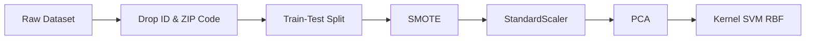
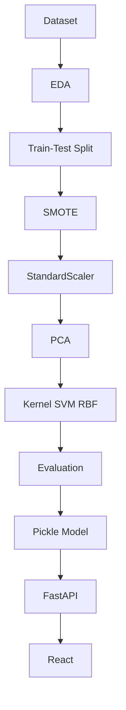
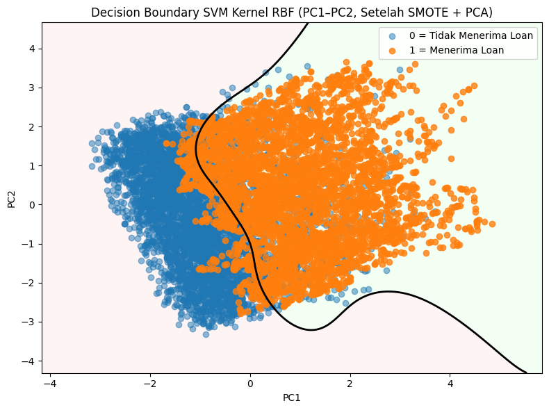
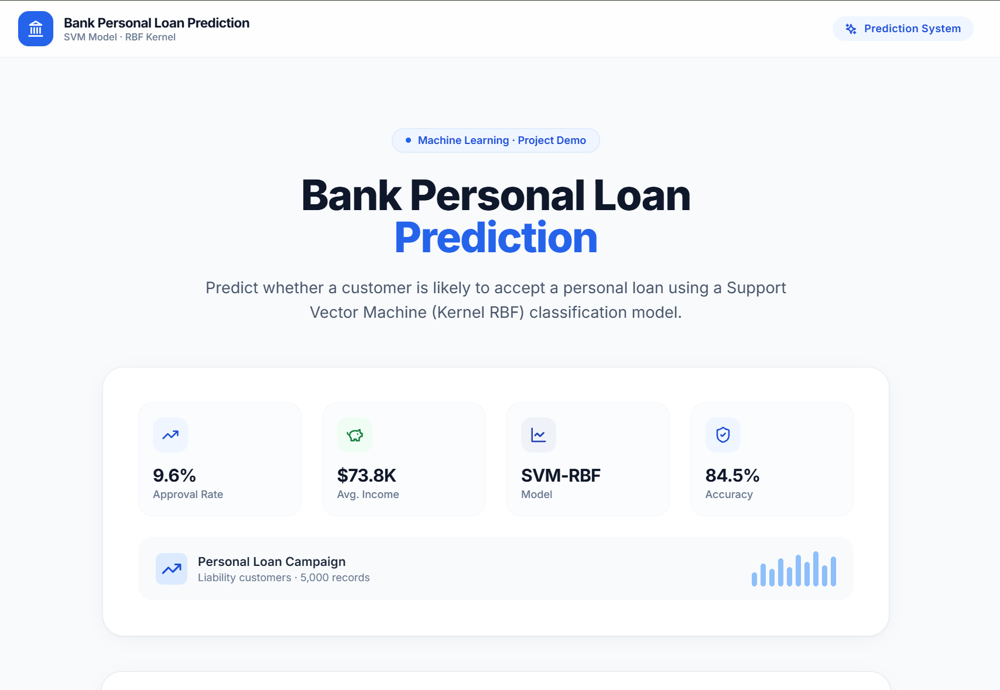
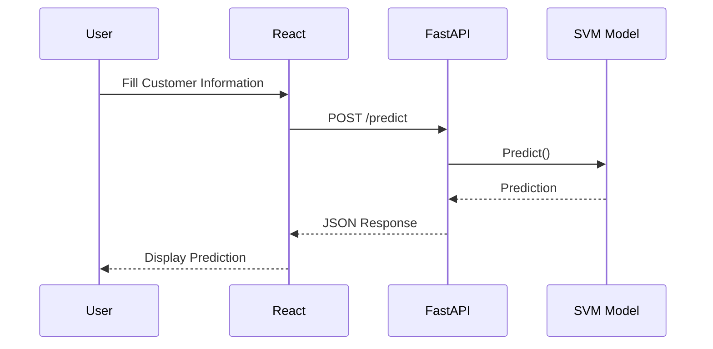
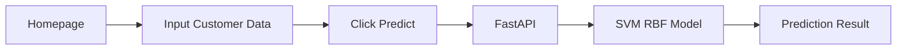

<div align="center">

# 🏦 Bank Personal Loan Acceptance Prediction
### Machine Learning Classification using Support Vector Machine (Kernel RBF)

<p align="center">


</p>

Predict whether a bank customer is likely to accept a personal loan offer using a **Support Vector Machine (Kernel RBF)** classification model with **SMOTE**, **StandardScaler**, **PCA**, **FastAPI**, and **React**.

---

</div>

# 📖 Table of Contents

- [Project Overview](#-project-overview)
- [Business Problem](#-business-problem)
- [Objectives](#-objectives)
- [Project Architecture](#-project-architecture)
- [Technology Stack](#-technology-stack)
- [Dataset Information](#-dataset-information)
- [Dataset Features](#-dataset-features)
- [Exploratory Data Analysis](#-exploratory-data-analysis)
- [Data Preprocessing](#-data-preprocessing)
- [Machine Learning Pipeline](#-machine-learning-pipeline)
- [Model Evaluation](#-model-evaluation)
- [Decision Boundary Visualization](#-decision-boundary-visualization)
- [Web Application](#-web-application)
- [REST API](#-rest-api)
- [Proof of Concept](#-proof-of-concept)
- [Project Structure](#-project-structure)
- [Installation](#-installation)
- [Future Improvements](#-future-improvements)
- [Author](#-author)

---

# 📖 Project Overview

Financial institutions continuously offer personal loan products to their customers.

However, offering loans indiscriminately increases marketing costs because only a small percentage of customers actually accept the offer.

This project develops a Machine Learning classification model capable of predicting whether a customer is likely to accept a personal loan offer based on demographic, financial, and banking information.

The prediction model is deployed as a REST API using FastAPI and integrated into a modern React-based web application.

---

# 🎯 Business Problem

Only **9.6%** of customers in the dataset accepted the personal loan offer.

This severe class imbalance makes traditional machine learning models biased toward the majority class.

The project addresses this issue by applying:

- SMOTE (Synthetic Minority Oversampling Technique)
- StandardScaler
- Principal Component Analysis (PCA)
- Support Vector Machine with RBF Kernel

to improve the model's capability in identifying potential customers.

---

# 🎯 Objectives

- Analyze customer financial behavior.
- Handle class imbalance using SMOTE.
- Build an SVM classifier with RBF Kernel.
- Evaluate model performance using multiple metrics.
- Deploy the model with FastAPI.
- Build an interactive prediction interface using React.
- Demonstrate an end-to-end Machine Learning deployment workflow.

---

# 🏗 Project Architecture

```text
                Dataset
                   │
                   ▼
        Exploratory Data Analysis
                   │
                   ▼
         Data Preprocessing
                   │
      ┌────────────┴────────────┐
      │                         │
      ▼                         ▼
 StandardScaler             SMOTE
      │                         │
      └────────────┬────────────┘
                   ▼
                  PCA
                   │
                   ▼
          Kernel SVM (RBF)
                   │
                   ▼
          Model Evaluation
                   │
                   ▼
           Pickle (.pkl)
                   │
                   ▼
              FastAPI API
                   │
                   ▼
             React Frontend
```

---

# 🛠 Technology Stack

| Category | Technology |
|------------|------------|
| Language | Python |
| Machine Learning | Scikit-Learn |
| Data Processing | Pandas |
| Numerical Computing | NumPy |
| Visualization | Matplotlib |
| API | FastAPI |
| Frontend | React + Vite |
| Styling | Tailwind CSS |
| Model Serialization | Pickle |
| Version Control | Git & GitHub |

---

# 📊 Dataset Information

Dataset Source

> Bank Personal Loan Modelling Dataset

Source:

https://data.mendeley.com/datasets/tx2v248cx4/1

Dataset Characteristics

| Property | Value |
|-----------|--------|
| Samples | 5,000 |
| Features | 12 |
| Target | Personal Loan |
| Task | Binary Classification |

The dataset consists of demographic, financial, and banking service information collected from bank customers.

The objective is to classify whether a customer will accept a personal loan offer.

---

# 📌 Original Dataset Distribution

| Class | Count | Percentage |
|--------|-------|------------|
| Loan Rejected | 4520 | 90.4% |
| Loan Accepted | 480 | 9.6% |

The dataset is highly imbalanced, making it difficult for standard classifiers to correctly identify the minority class.

Therefore, SMOTE was employed before training the model.

---

# 📋 Dataset Features

| Feature | Description |
|----------|-------------|
| ID | Unique customer identifier |
| Age | Customer age |
| Experience | Years of professional work experience |
| Income | Annual income (thousand USD) |
| ZIP Code | Customer residential ZIP code |
| Family | Number of family members |
| CCAvg | Average monthly credit card spending (thousand USD) |
| Education | Education level (1 = Undergraduate, 2 = Graduate, 3 = Advanced/Professional) |
| Mortgage | Mortgage value (thousand USD) |
| Securities Account | Whether the customer owns a securities account |
| CD Account | Whether the customer owns a Certificate of Deposit account |
| Online | Whether the customer uses online banking |
| CreditCard | Whether the customer uses the bank's credit card |
| Personal Loan | Target variable (0 = Rejected, 1 = Accepted) |

---

# 📊 Sample Dataset

| Age | Experience | Income | Family | CCAvg | Education | Mortgage | Loan |
|------|------------|---------|---------|--------|------------|------------|------|
|25|1|49|4|1.6|1|0|0|
|45|19|34|3|1.5|1|0|0|
|39|15|11|1|1.0|1|0|0|
|35|9|100|1|2.7|2|0|0|
|35|8|45|4|1.0|2|0|0|

---

# 📈 Exploratory Data Analysis

The initial exploratory analysis revealed several important findings:

- The dataset contains 5,000 customer records.
- Only 480 customers accepted the loan offer.
- Income shows a significant difference between accepted and rejected classes.
- Customers accepting loans tend to have higher monthly credit card spending.
- Mortgage ownership also contributes to prediction performance.
- Class imbalance is the major challenge for the classification task.

---

# ⚙️ Data Preprocessing

Before training the classification model, several preprocessing techniques were applied to improve data quality and model performance.

## Preprocessing Workflow



The preprocessing consists of:

- Removing non-informative attributes (ID and ZIP Code).
- Splitting the dataset into training and testing sets.
- Handling class imbalance using SMOTE.
- Standardizing numerical features with StandardScaler.
- Reducing feature dimensions using Principal Component Analysis (PCA).
- Training the classifier using Support Vector Machine with Radial Basis Function (RBF) Kernel.

---

# ⚖️ Handling Imbalanced Dataset using SMOTE

The original dataset exhibits a severe class imbalance.

## Original Dataset

| Class | Samples | Percentage |
|--------|---------|------------|
| Loan Rejected | 4520 | 90.4% |
| Loan Accepted | 480 | 9.6% |

Such an imbalance may cause the classifier to become biased toward the majority class.

To address this issue, **Synthetic Minority Oversampling Technique (SMOTE)** was applied.

---

## Dataset After SMOTE

| Class | Samples |
|--------|---------|
| Loan Rejected | 4520 |
| Loan Accepted | 4520 |

The resulting dataset becomes perfectly balanced, enabling the classifier to learn representative decision boundaries for both classes.

---

## Dataset Shape

| Stage | Shape |
|--------|------------|
| Original Dataset | (5000, 14) |
| After SMOTE | (9040, 12) |

---

## Why SMOTE?

SMOTE generates synthetic minority-class samples instead of duplicating existing observations.

Advantages include:

- Reduces class imbalance.
- Prevents classifier bias.
- Improves Recall.
- Produces better decision boundaries.
- Reduces overfitting caused by simple oversampling.

---

# 📊 Exploratory Data Analysis

Several interesting insights were observed during EDA.

## Customer Income

Customers who accepted the loan generally have significantly higher annual income.

| Class | Average Income |
|--------|---------------:|
| Rejected | 66.24 |
| Accepted | 144.75 |

---

## Credit Card Spending

Customers with higher monthly credit card expenditure tend to accept loan offers more frequently.

| Class | Average CCAvg |
|--------|--------------:|
| Rejected | 1.73 |
| Accepted | 3.91 |

---

## Mortgage

Mortgage ownership is another important indicator.

| Class | Average Mortgage |
|--------|-----------------:|
| Rejected | 51.79 |
| Accepted | 100.85 |

---

## Education

Loan acceptance tends to increase among customers with higher educational backgrounds.

| Class | Mean Education |
|--------|---------------:|
| Rejected | 1.84 |
| Accepted | 2.23 |

---

# 📉 Principal Component Analysis (PCA)

Principal Component Analysis (PCA) was applied to reduce dimensionality and visualize high-dimensional customer data.

PCA transforms correlated variables into a smaller number of principal components while preserving as much variance as possible.

---

## PCA Visualization (45° View)

> 📷 Replace with:

```text
docs/images/pca-45.png
```


---

## PCA Visualization (135° View)

> 📷 Replace with:

```text
docs/images/pca-135.png
```


---

### Observation

The PCA visualization demonstrates that the two classes become more distinguishable after preprocessing.

Although some overlap remains, distinct clusters begin to emerge, supporting the effectiveness of the preprocessing pipeline.

---

# 🤖 Machine Learning Pipeline



---

# 🧠 Support Vector Machine (Kernel RBF)

The classifier used in this project is **Support Vector Machine (SVM)** with the **Radial Basis Function (RBF)** kernel.

The RBF kernel is capable of learning highly non-linear relationships between customer attributes and loan acceptance.

Unlike linear classifiers, the RBF kernel projects data into a higher-dimensional feature space, enabling more flexible decision boundaries.

Advantages include:

- Excellent performance on non-linear problems.
- Robust generalization.
- Effective in high-dimensional spaces.
- Strong classification capability with appropriate hyperparameters.

---

# 📈 Model Evaluation

The trained model was evaluated using multiple classification metrics.

| Metric | Score |
|----------|-------:|
| Accuracy | **84.51%** |
| Precision | **81.79%** |
| Recall | **88.84%** |
| F1-Score | **85.17%** |

The model demonstrates balanced performance across all evaluation metrics.

A particularly high Recall indicates that the classifier successfully identifies most customers who are likely to accept the personal loan offer.

---

# 📋 Confusion Matrix

| | Predicted Reject | Predicted Accept |
|----------------|---------------:|---------------:|
| Actual Reject | **724** | **179** |
| Actual Accept | **101** | **804** |

Summary

- True Positive : **804**
- True Negative : **724**
- False Positive : **179**
- False Negative : **101**

---

## Evaluation Analysis

The model achieves a good trade-off between Precision and Recall.

High Recall is especially beneficial in banking marketing campaigns because it minimizes the number of potential customers who are incorrectly classified as not interested.

This allows banks to target a larger proportion of customers who are genuinely likely to accept a personal loan offer.

---

# 🌊 Decision Boundary Visualization

The figure below illustrates the non-linear decision boundary learned by the Support Vector Machine with the RBF kernel.

> 📷 Replace with:

```text
docs/images/decision-boundary.png
```



---

### Interpretation

The RBF kernel successfully captures complex non-linear relationships among customer attributes.

Unlike linear classifiers, the generated decision boundary follows the natural distribution of the data, resulting in improved classification performance.

This demonstrates the ability of the model to separate customers who are likely to accept personal loan offers from those who are not.

---

# 🌐 Web Application

The machine learning model has been successfully deployed as a RESTful API using **FastAPI** and integrated into a modern web interface built with **React**.

The application enables users to input customer information and instantly receive loan acceptance predictions.

---

## ✨ Features

- 🧠 Machine Learning Prediction
- ⚡ FastAPI REST API
- 💻 Modern React User Interface
- 📱 Responsive Design
- 🔄 Real-Time Prediction
- 📊 Instant Classification Result
- 🚀 Pickle Model Deployment
- 📖 Interactive Swagger Documentation

---

# 🖥 Application Interface

## 🏠 Homepage

> Replace with:

```text
docs/images/homepage.png
```



The homepage introduces the application and provides users with a simple interface for navigating to the prediction page.

---

## 📝 Customer Prediction Form

> Replace with:

```text
docs/images/prediction-form.png
```


Users are required to provide customer information including:

- Age
- Work Experience
- Annual Income
- Family Size
- Average Credit Card Spending
- Education
- Mortgage
- Securities Account
- CD Account
- Online Banking
- Credit Card Ownership

The application validates the input before sending the request to the backend.

---

## ✅ Accepted Loan Prediction

> Replace with:

```text
docs/images/prediction-accepted.png
```


If the customer is predicted to accept the loan offer, the system returns a positive prediction.

---

## ❌ Rejected Loan Prediction

> Replace with:

```text
docs/images/prediction-rejected.png
```


If the customer is predicted not to accept the loan offer, the application displays a rejection prediction.

---

# ⚙ Backend Architecture

The backend is implemented using **FastAPI**.

Responsibilities include:

- Loading trained SVM model (.pkl)
- Receiving HTTP requests
- Input validation
- Running prediction
- Returning JSON response
- Supporting Swagger UI documentation

---

## Backend Workflow



---

# 🔗 REST API

## Endpoint

```http
POST /predict
```

---

## Request Body

```json
{
  "Age": 35,
  "Experience": 10,
  "Income": 90,
  "Family": 3,
  "CCAvg": 2.5,
  "Education": 2,
  "Mortgage": 100,
  "SecuritiesAccount": 0,
  "CDAccount": 1,
  "Online": 1,
  "CreditCard": 1
}
```

---

## Success Response

```json
{
  "prediction": 1,
  "label": "Accepted"
}
```

---

## HTTP Status

| Status | Description |
|---------|-------------|
| 200 | Prediction Success |
| 422 | Validation Error |
| 500 | Internal Server Error |

---

# 📖 Swagger Documentation

FastAPI automatically generates interactive API documentation.

> Replace with:

```text
docs/images/swagger.png
```


Swagger enables developers to test every endpoint directly from the browser without external tools.

Default URL

```text
http://127.0.0.1:8000/docs
```

---

# 📸 Proof of Concept

This section demonstrates the complete workflow of the application.



---

## Step 1 — Homepage

📷

```text
docs/images/homepage.png
```

Description:

Landing page of the application.

---

## Step 2 — Fill Customer Information

📷

```text
docs/images/prediction-form.png
```

Description:

Users provide customer attributes required for prediction.

---

## Step 3 — API Request

📷

```text
docs/images/swagger.png
```

Description:

FastAPI receives prediction request.

---

## Step 4 — Machine Learning Prediction

📷

```text
docs/images/decision-boundary.png
```

Description:

The trained Kernel SVM model performs binary classification.

---

## Step 5 — Display Prediction

📷

```text
docs/images/prediction-accepted.png
```

or

```text
docs/images/prediction-rejected.png
```

Description:

The frontend displays the prediction result returned by the backend.

---

# 📂 Project Structure

```text
Bank-Personal-Loan-Prediction
│
├── dataset
│   ├── bank_personal_loan_data.csv
│   └── ...
│
├── frontend
│   └── Bank-Personal-Loan-Prediction
│
├── docs
│   └── images
│
├── main.py
├── svm_rbf_bank_loan_model.pkl
├── requirements.txt
│
├── SMOTE.ipynb
├── SVM.ipynb
├── data_statistic.ipynb
│
└── README.md
```

---

# ⚙ Installation

## Clone Repository

```bash
git clone https://github.com/USERNAME/Bank-Personal-Loan-Prediction.git
```

---

## Backend

```bash
cd Bank-Personal-Loan-Prediction

python -m venv .venv

source .venv/Scripts/activate
```

Install dependencies

```bash
pip install -r requirements.txt
```

Run FastAPI

```bash
uvicorn main:app --reload
```

Backend URL

```text
http://127.0.0.1:8000
```

Swagger

```text
http://127.0.0.1:8000/docs
```

---

## Frontend

```bash
cd frontend/Bank-Personal-Loan-Prediction

npm install

npm run dev
```

Default URL

```text
http://localhost:5173
```

---

# 🚀 Future Improvements

Several enhancements can further improve the project.

- Docker Deployment
- Cloud Deployment
- CI/CD Pipeline
- User Authentication
- Database Integration
- Model Monitoring
- Explainable AI (SHAP / LIME)
- Hyperparameter Optimization
- Automated Retraining
- Logging & Analytics
- Unit Testing
- Integration Testing

---

# 👨‍💻 Author

**Fachrizal Fazza Ashari**

Backend Developer | Machine Learning Enthusiast

- 🎓 Information Systems Graduate
- 💼 Interested in Backend Engineering & Artificial Intelligence

GitHub

```
https://github.com/Nilfgard13
```

LinkedIn

```
https://www.linkedin.com/in/fachrizal-fazza-ashari
```

---

# ⭐ Support

If you find this project useful, please consider giving it a ⭐ on GitHub.

It helps others discover the project and motivates future improvements.

---

# 📄 License

This project is licensed under the **MIT License**.

Feel free to use, modify, and distribute this project for educational and research purposes.

---

<div align="center">

### ⭐ Thank you for visiting this repository ⭐

Built with ❤️ using Python, FastAPI, React, and Machine Learning.

</div>